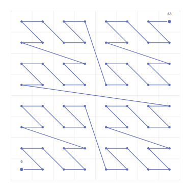

## 2.6. Z-порядок и линейное упорядочение

IP-адреса — это целые числа. Когда мы записываем маршрутизационную таблицу или ищем, принадлежит ли адрес сети, мы неявно используем числовой порядок: адрес `10.0.0.1` «меньше» `10.0.0.2`. Для контигуальной маски это удобно: все адреса сети образуют сплошной числовой отрезок, и проверка принадлежности сводится к двум сравнениям. Но что происходит с неконтигуальной маской? Адреса сети оказываются разбросаны по числовой прямой — между ними «живут» чужие адреса. Понять эту разбросанность помогает Z-кривая.

### Что такое Z-кривая

Когда мы интерпретируем адреса как целые числа, мы превращаем $n$-мерный гиперкуб в одномерную последовательность. Этот конкретный способ линеаризации гиперкуба имеет имя — **Z-кривая** (кривая Мортона, Z-order curve).

Z-кривая — это отображение $Z: \{0,1\}^n \to \{0, \ldots, 2^n - 1\}$, которое чередует биты координат. В нашем случае координаты — это и есть биты адреса, а Z-кривая совпадает с тождественным отображением: $Z(X) = \text{int}(X)$. Иными словами, стандартный целочисленный порядок адресов *уже является* Z-порядком.



### Числовой пример: как адреса неконтигуальной сети разбросаны

Рассмотрим 6-битовое адресное пространство и сеть с адресом `000000` и маской `101010`. Свободные биты (позиции 0, 2, 4 от младшего) принимают любые значения, фиксированные биты (позиции 1, 3, 5) всегда равны нулю. Мощность сети: $2^3 = 8$ адресов.

Пронумеруем адреса сети по индексу хоста $h$ от 0 до 7:

| $h$ (двоичн.) | Адрес сети (двоичн.) | Адрес (десятич.) |
|:---:|:---:|:---:|
| `000` | `000000` | 0 |
| `001` | `000001` | 1 |
| `010` | `000100` | 4 |
| `011` | `000101` | 5 |
| `100` | `010000` | 16 |
| `101` | `010001` | 17 |
| `110` | `010100` | 20 |
| `111` | `010101` | 21 |

Биты индекса $h$ «вставляются» в свободные позиции маски: нулевой бит $h$ идёт в позицию 0, первый — в позицию 2, второй — в позицию 4. Адреса сети `0, 1, 4, 5, 16, 17, 20, 21` разбросаны по числовой прямой от 0 до 63 — между `1` и `4` стоят `2, 3`, между `5` и `16` — целых десять чужих адресов, и так далее. Числа `2, 3, 6, 7` и многие другие принадлежат другим сетям, но не этой.


### Наблюдение про интервал и контигуальность

> $S(a, m)$ является интервалом (непрерывным отрезком) в целочисленном порядке **тогда и только тогда**, когда маска $m$ контигуальна.

**Интуиция.** Контигуальная маска вида $1^k 0^{n-k}$ фиксирует $k$ старших битов и оставляет $n-k$ младших свободными. Свободные биты пробегают все значения от $\underbrace{00\ldots0}_{n-k}$ до $\underbrace{11\ldots1}_{n-k}$, не пропуская ни одного целого числа — получается сплошной отрезок.

Неконтигуальная маска оставляет свободным бит $i$ и фиксирует бит $j$ при $j > i$. Это значит, что между двумя адресами сети, отличающимися в позиции $i$, разница равна $2^{n-1-i}$, тогда как бит $j$ вносит разницу лишь $2^{n-1-j} < 2^{n-1-i}$. Адрес, который отличается от $a$ только в позиции $j$ (меняя зафиксированный бит), оказывается числовой «дыркой» между адресами сети — он не принадлежит $S(a, m)$, но лежит строго между двумя её элементами.


Формальное доказательство в направлении «контигуальная ⟹ интервал» дано в теореме 2c. Обратное направление («не контигуальная ⟹ не интервал») следует непосредственно из описанной выше конструкции «дырки» между адресами сети.

### Связь с итерацией и `pdep`

Z-кривая объясняет, почему итерация по неконтигуальной сети нетривиальна. Для контигуальной маски `/k` достаточно простого инкремента: адреса идут подряд от $a$ до $a + 2^{n-k} - 1$.

Для неконтигуальной маски адреса «прыгают» по Z-кривой. Чтобы получить $h$-й адрес сети, нам нужно «расставить» биты индекса $h$ по свободным позициям маски, не трогая зафиксированные биты.

Именно это делает процессорная инструкция `pdep` (parallel bit deposit): она берёт значение $h$ и распределяет его биты в те позиции, где маска-шаблон равна единице.

Например, для нашей 6-битовой маски $m = \texttt{101010}$ и $h = 3 = \texttt{011}$:

```
h              =       0     1     1  (биты индекса)
¬m = 010101    = 0  1  0  1  0  1     (свободные позиции — единицы)
pdep(h, ¬m)    = 0  0  0  1  0  1     = 5
```

Биты $h$ расставлены по единичным позициям $\lnot m$: результат 5 — ровно четвёртый адрес из нашей таблицы ($h = 3$).

Итератор в библиотеке использует эту операцию для вычисления $h$-го адреса сети:

$$\text{addr}(h) = a \lor \text{pdep}(h, \lnot m)$$

## 2.7. Итоги

Подведём итоги глав 1–2 сводной таблицей:

| Свойство | Контигуальная маска $/k$ | Неконтигуальная маска |
|---|---|---|
| Определение маски | $1^k 0^{n-k}$ | Произвольная $m \in \{0,1\}^n$ |
| Целочисленный вид | Выровненный интервал $[a, a+2^{n-k}-1]$ | Рассеянное подмножество |
| Геометрический вид | Грань, свободны последние $n-k$ координат | Грань, свободные координаты разбросаны |
| Z-кривая | Непрерывный участок | Несколько разрозненных участков |
| Вложенность | Строгая: вложение или непересечение | Частичное пересечение возможно |
| Итерация | Простой инкремент | Требуется `pdep` |
| Мощность | $2^{n-k}$ | $2^{n - \text{popcount}(m)}$ |
| Алгебра | Координатное аффинное подпр-во $GF(2)^n$ | Координатное аффинное подпр-во $GF(2)^n$ |

В обоих случаях сеть — это грань булева гиперкуба $\{0,1\}^n$, она же координатное аффинное подпространство $GF(2)^n$. Маска задаёт фиксированные координаты, адрес — их значения. Мощность определяется числом свободных координат. Пересечение двух граней — всегда грань или пустое множество.

Разница между контигуальным и неконтигуальным случаем — не в алгебре (она одинакова), а в отношении к Z-кривой: контигуальные грани ложатся на неё непрерывными участками, неконтигуальные — нет.

Это различие имеет практические следствия для итерации, маршрутизации и агрегации, которые мы рассмотрим в последующих главах.
