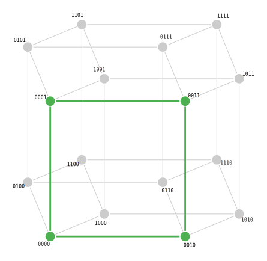
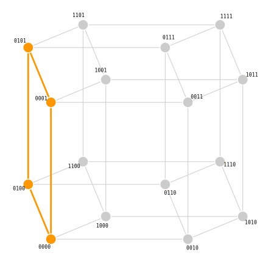
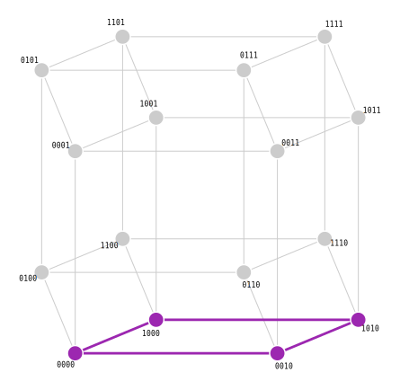
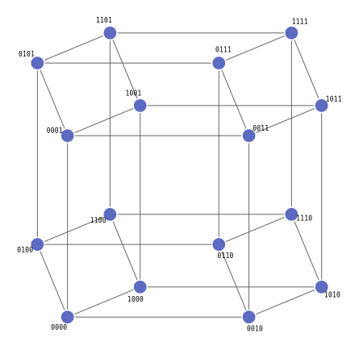

# Глава 2. Структура сетей

## 2.1. Булев гиперкуб $\{0,1\}^n$

Рассмотрим адресное пространство $\{0,1\}^n$ как множество вершин $n$-мерного гиперкуба. Каждый бит адреса — это координата, принимающая значение 0 или 1.

- При $n = 1$: два адреса — точки отрезка.
- При $n = 2$: четыре адреса — вершины квадрата.
- При $n = 3$: восемь адресов — вершины куба.
- При $n = 4$: шестнадцать адресов — вершины тессеракта.

Две вершины соединены ребром, если они отличаются ровно в одном бите (расстояние Хэмминга равно 1).

**Определение.** **Грань** (face, subcube) гиперкуба $\{0,1\}^n$ — это подмножество, полученное фиксацией некоторых координат и оставлением остальных свободными. Формально, грань задаётся множеством фиксированных координат $P \subseteq \{0, \ldots, n-1\}$ и значениями $v_i \in \{0,1\}$ для каждого $i \in P$:

$$\text{Face}(P, v) = \{X \in \{0,1\}^n : X[i] = v_i \text{ для всех } i \in P\}$$

Размерность грани равна $n - |P|$ - количеству свободных координат.

### Теорема 2a: сеть = грань

> Сеть $S(a, m)$ является гранью гиперкуба $\{0,1\}^n$ размерности $n - \text{popcount}(m)$.

#### Доказательство

Положим $P = \{i : m[i] = 1\}$ (фиксированные координаты) и $v_i = a[i]$ для $i \in P$. Тогда:

$$X \in S(a, m) \iff X \land m = a \iff \forall i \in P:\ X[i] = a[i] \iff X \in \text{Face}(P, v)$$

Первая эквивалентность — определение $S(a,m)$. Вторая следует из того, что условие $X \land m = a$ побитово означает: для каждого $i$, если $m[i] = 1$, то $X[i] = a[i]$; если $m[i] = 0$, то $0 = 0$ (по нормализации $a[i] = 0$), что выполнено для любого $X[i]$.

Размерность грани: $n - |P| = n - \text{popcount}(m)$. $\blacksquare$

**Ключевое различие.**

- Контигуальная маска с префиксом $k$: фиксированы первые $k$ координат, свободны последние $n - k$. Грань «стоит» в одном из углов гиперкуба, и все её свободные координаты сосредоточены в младших разрядах.
- Неконтигуальная маска: фиксированные координаты разбросаны произвольно. Грань «наклонена» относительно естественных осей — она пронизывает гиперкуб в неочевидном направлении.

## 2.3. Геометрическая интерпретация: пример при $n = 4$

Теория гиперкуба и аффинных подпространств может казаться абстрактной. Рассмотрим конкретный пример с $n = 4$ (16 адресов), чтобы увидеть, как контигуальные и неконтигуальные грани выглядят на практике. Запишем адреса как четырёхбитные строки $b_0 b_1 b_2 b_3$.

### Контигуальная грань: маска $1100$

Сеть $(0000, 1100)$: фиксированы биты 0 и 1 (оба нулевые), свободны биты 2 и 3.

$$S = \{0000, 0001, 0010, 0011\} = \{0, 1, 2, 3\}$$

На числовой прямой — непрерывный блок. Это двумерная грань (квадрат) в углу четырёхмерного куба.



Числовая прямая:

```text
0  1  2  3  4  5  6  7  8  9  10 11 12 13 14 15
■  ■  ■  ■  ·  ·  ·  ·  ·  ·  ·  ·  ·  ·  ·  ·
└────────┘
  непрерывный блок
```

### Неконтигуальная грань: маска $1010$

Сеть $(0000, 1010)$: фиксированы биты 0 и 2 (оба нулевые), свободны биты 1 и 3.

$$S = \{0000, 0001, 0100, 0101\} = \{0, 1, 4, 5\}$$

На числовой прямой — два отдельных блока. Это тоже двумерная грань (квадрат), но «повёрнутая» относительно естественных осей.



Числовая прямая:

```text
0  1  2  3  4  5  6  7  8  9  10 11 12 13 14 15
■  ■  ·  ·  ■  ■  ·  ·  ·  ·  ·  ·  ·  ·  ·  ·
└──┘        └──┘
  два фрагмента
```

### Ещё одна неконтигуальная грань: маска $0101$

Сеть $(0000, 0101)$: фиксированы биты 1 и 3, свободны биты 0 и 2.

$$S = \{0000, 0010, 1000, 1010\} = \{0, 2, 8, 10\}$$



```text
0  1  2  3  4  5  6  7  8  9  10 11 12 13 14 15
■  ·  ■  ·  ·  ·  ·  ·  ■  ·  ■  ·  ·  ·  ·  ·
```

Четыре точки, разбросанные по числовой прямой. Однако в гиперкубе они по-прежнему образуют квадрат — просто расположенный «по диагонали» относительно Z-кривой.

### Весь 4-куб

Для полноты картины покажем все 16 вершин четырёхмерного гиперкуба и выделим на нём наши грани:



На этом графе контигуальная грань $\{0000, 0001, 0010, 0011\}$ — это «нижний левый угол», а неконтигуальная грань $\{0000, 0001, 0100, 0101\}$ — «диагональный срез». Обе — квадраты из четырёх вершин, связанных рёбрами, но по-разному расположенные в гиперкубе.
